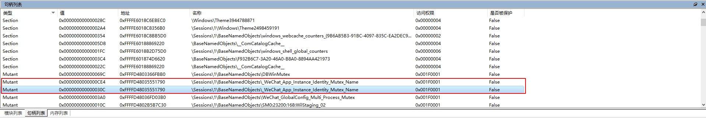
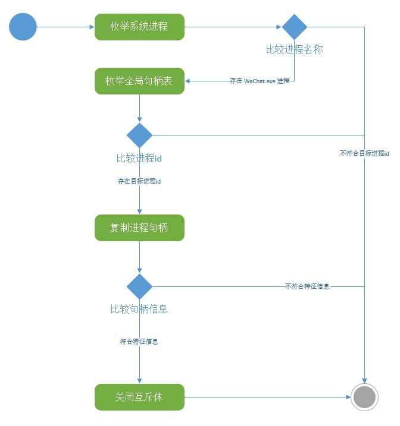

# 概述
`WeChatPC` 是一款 微信多开工具。

本文主要使用代码实现多开，简单修改可破除类似原理的网络游戏限制多开。
### 使用说明
运行 `WeChatPC.exe` 即可。

### 主要特征
* 支持无限多开。
* 一键启动微信。

### 下载地址
https://github.com/cheungxiongwei/WeChatPC/releases/download/1.0/WeChatPC.rar

### 源代码编译
`git clone https://github.com/cheungxiongwei/WeChatPC.git`

打开 `WeChatPC` 目录。

使用 VS2010 或更高版本 打开 `WeChatPC.sln` 项目文件，正常编译即可。

> 注意：一定要选择 x86 进行编译。

### 主要原理
微信使用互斥体作为限制，正常情况下使其仅能开启一个客户端。
通过使用 `火绒工具` 查看目标进程句柄列表，可发现`红色标记框`中的2个句柄关闭后，即可继续开启微信。

类似的网络游戏使用此原理限制多开，比如 `天龙八部` 、`笑傲江湖OL` 等。

### 主要流程
1. 使用 `ZwQuerySystemInformation` 函数枚举系统进程信息，找到 `WeChat.exe` 进程，获取其进程 id。
2. 使用 `ZwQuerySystemInformation` 函数枚举全局句柄列表（系统上所有的句柄列表），通过比较句柄拥有者进程 id，获取 `WeChat.exe` 目标句柄。
3. 使用 `DuplicateHandle` 跨进程复制句柄，第一次复制仅查询比较 `类型` 、`名称`，第二次复制关闭找到的目标句柄。

### 声明
本项目仅供技术研究，请勿用于任何商业用途，请勿用于非法用途，如有任何人凭此做何非法事情，均于作者无关，特此声明
